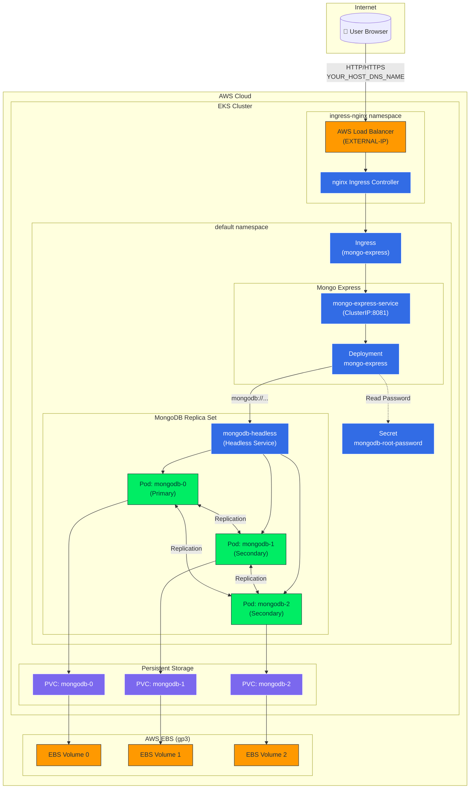

# Architecture Diagram

## Component Overview

| Component | Description |
|-----------|-------------|
| **AWS Load Balancer** | Automatically provisioned by nginx Ingress Controller to handle external traffic |
| **nginx Ingress Controller** | Routes HTTP traffic based on host/path rules to internal services |
| **Ingress Resource** | Defines routing rules to direct traffic to mongo-express-service |
| **Mongo Express** | Web UI for MongoDB administration (Deployment + Service) |
| **MongoDB Replica Set** | 3-node StatefulSet with primary/secondary replication |
| **Headless Service** | Enables direct pod-to-pod communication for replica set |
| **Kubernetes Secret** | Stores MongoDB root password securely |
| **PersistentVolumeClaims** | Request storage from AWS EBS for each MongoDB replica |
| **AWS EBS (gp3)** | Persistent block storage for MongoDB data |

## Traffic Flow

1. User accesses `http(s)://YOUR_HOST_DNS_NAME/` in browser (HTTPS recommended for production)
2. DNS resolves to AWS Load Balancer external IP
3. Load Balancer forwards to nginx Ingress Controller
4. Ingress Controller matches host rule and routes to mongo-express-service
5. Mongo Express connects to MongoDB via headless service (`mongodb-0.mongodb-headless:27017`)
6. MongoDB replica set maintains data consistency across 3 pods
7. Each MongoDB pod persists data to its own AWS EBS volume
